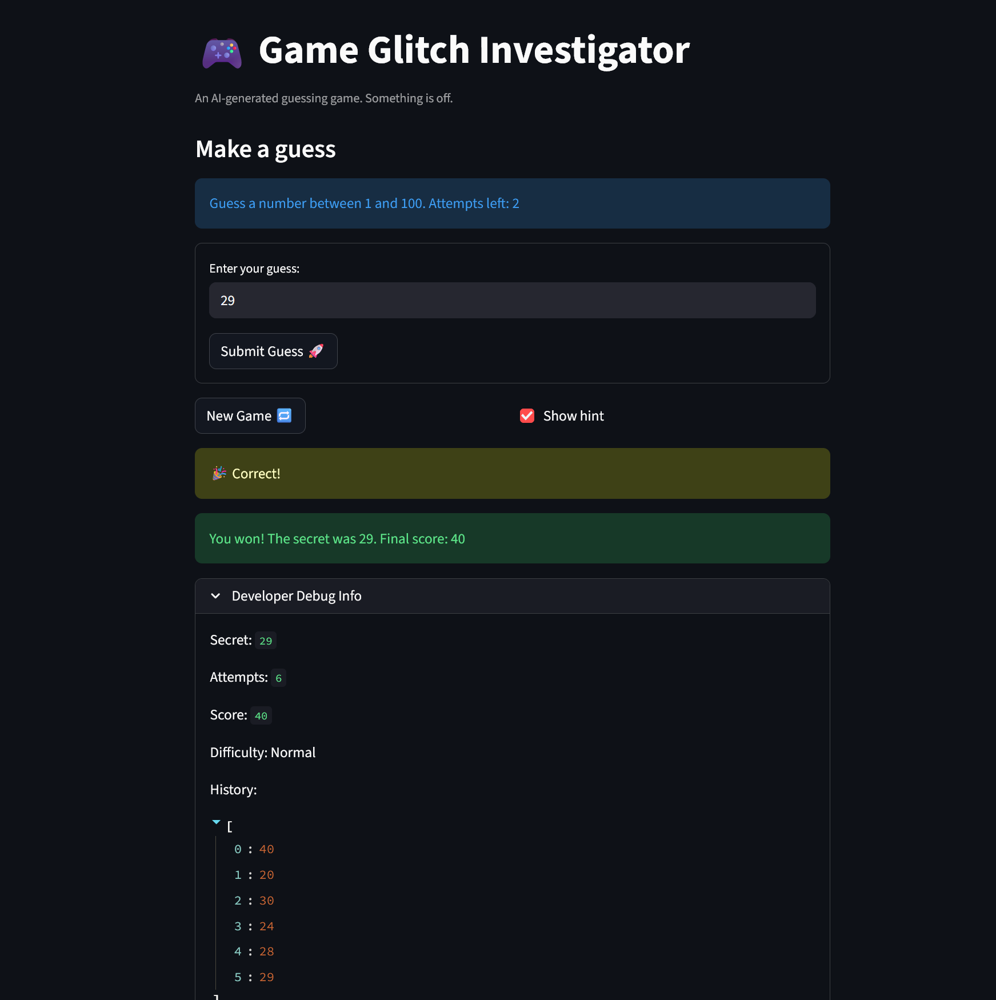
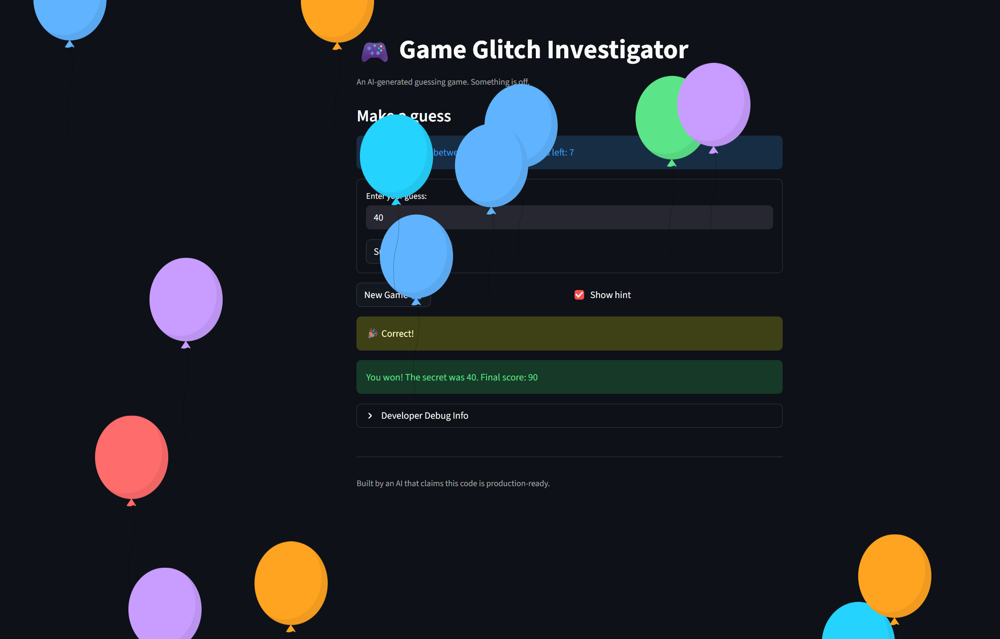
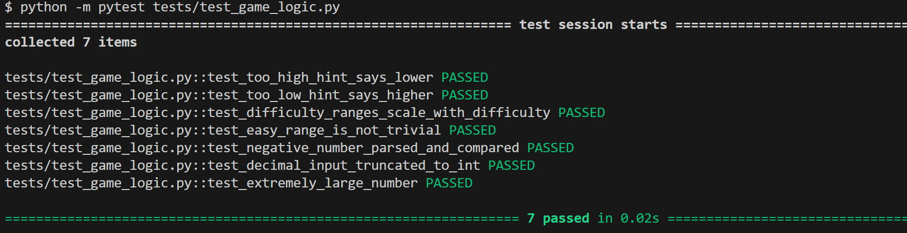

# 🎮 Game Glitch Investigator: The Impossible Guesser

## 🚨 The Situation

You asked an AI to build a simple "Number Guessing Game" using Streamlit.
It wrote the code, ran away, and now the game is unplayable. 

- You can't win.
- The hints lie to you.
- The secret number seems to have commitment issues.

## 🛠️ Setup

1. Install dependencies: `pip install -r requirements.txt`
2. Run the broken app: `python -m streamlit run app.py`

## 🕵️‍♂️ Your Mission

1. **Play the game.** Open the "Developer Debug Info" tab in the app to see the secret number. Try to win.
2. **Find the State Bug.** Why does the secret number change every time you click "Submit"? Ask ChatGPT: *"How do I keep a variable from resetting in Streamlit when I click a button?"*
3. **Fix the Logic.** The hints ("Higher/Lower") are wrong. Fix them.
4. **Refactor & Test.** - Move the logic into `logic_utils.py`.
   - Run `pytest` in your terminal.
   - Keep fixing until all tests pass!

## 📝 Document Your Experience

- [x] **Game's purpose:** A Streamlit number guessing game where the player picks a difficulty, then tries to guess a secret number within a limited number of attempts using higher/lower hints.
- [x] **Bugs found:**
  1. The higher/lower hints were swapped. Guessing too high said "Go HIGHER!" and guessing too low said "Go LOWER!".
  2. `get_range_for_difficulty` sets per-difficulty ranges (Easy: 1-20, Hard: 1-50), but the UI hardcodes "Guess a number between 1 and 100." The ranges are also illogical since Hard (1-50) is easier than Normal (1-100).
  3. The game accepted out-of-bound guesses with no validation.
  4. Normal difficulty allowed the most attempts (8 vs 6 for Easy), which is counterintuitive.
  5. Attempts counter started at 1 instead of 0, wasting an attempt and showing incorrect "attempts left".
  6. On even-numbered attempts, the secret was converted to a string, causing type mismatches and wrong comparison results.
  7. "New Game" only reset attempts. It did not reset score, status, or history, and it hardcoded `randint(1, 100)` instead of using the selected difficulty range.
  8. Clicking "Submit" required two clicks because the text input value wasn't committed on the first button press.
  9. The Debug Info history only showed guesses from the previous rerun because the expander rendered before the form submission was processed.
  10. `update_score` changed the score on wrong guesses. "Too High" on even attempts even added 5 points, rewarding incorrect answers. The win calculation also had an off-by-one error (`attempt_number + 1`).
- [x] **Fixes applied:**
  1. Moved `check_guess` from `app.py` to `logic_utils.py` and corrected the swapped hint messages so "Too High" says "Go LOWER!" and "Too Low" says "Go HIGHER!".
  2. Moved `get_range_for_difficulty` to `logic_utils.py` and corrected the ranges so they scale with difficulty (Easy: 1-50, Normal: 1-100, Hard: 1-200). Fixed the UI to display the actual range instead of hardcoding "1 and 100".
  3. Corrected attempt limits so easier difficulties get more attempts (Easy: 10, Normal: 7, Hard: 5).
  4. Moved `parse_guess` to `logic_utils.py` and added edge case tests for negative numbers, decimals, and extremely large values.
  5. Changed initial attempts from 1 to 0 so the attempt count and "attempts left" display are accurate.
  6. Removed the `str()` cast that converted the secret to a string on even attempts, so `check_guess` always compares two integers.
  7. Fixed "New Game" to fully reset all session state (score, status, history) and generate the secret using the actual difficulty range.
  8. Wrapped the text input and submit button in `st.form` so the guess submits on the first click.
  9. Moved the Debug Info expander below the form processing so the history displays all guesses including the current one.
  10. Fixed `update_score` to only award points on a win. Removed wrong-guess score changes and fixed the off-by-one in the win calculation.

## 📸 Demo

- [x] Fixed game with a winning result and full guess history:

- [x] Pytest results (7 tests passing, including 3 edge case tests for Challenge 1):

## 🚀 Stretch Features

- [ ] [If you choose to complete Challenge 4, insert a screenshot of your Enhanced Game UI here]
